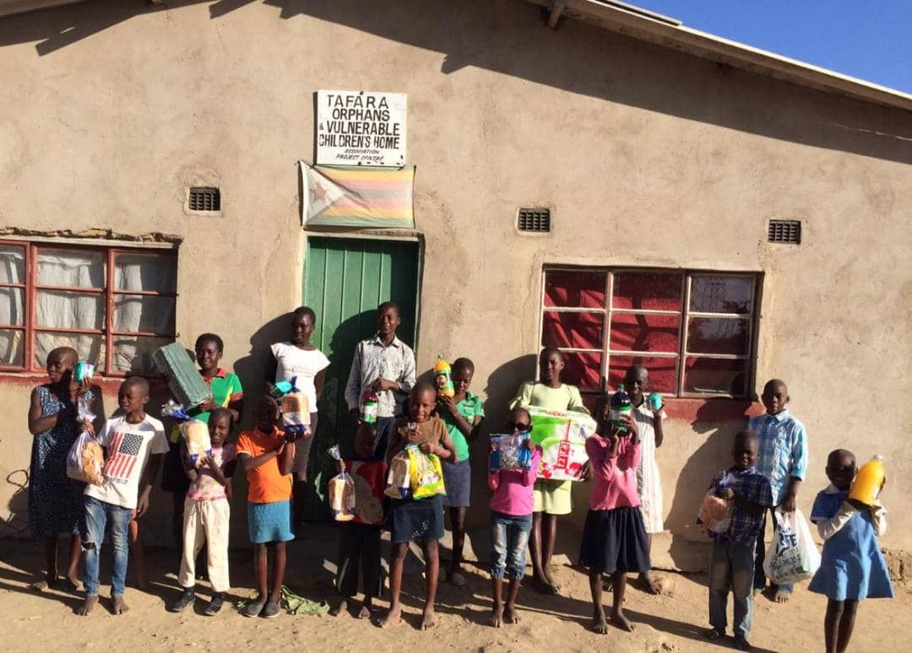
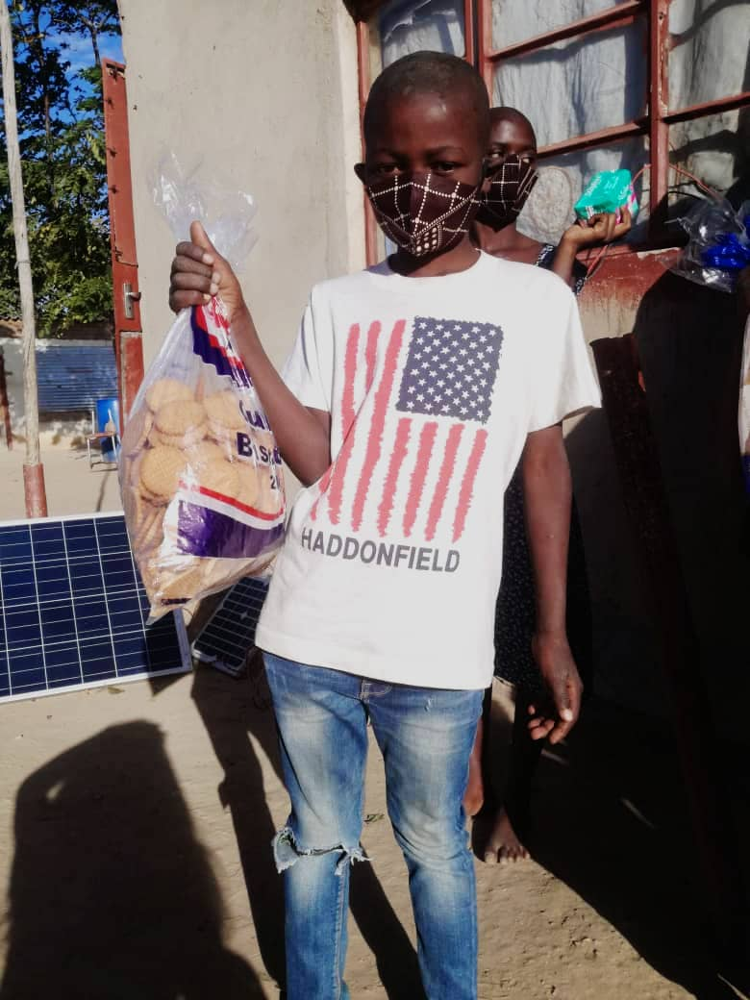

As the saying goes, a simple act of kindness can make a huge difference in someone's life. It started like this, one Sunday morning I visited the store to buy sanitary pads which by that time was 1 USD, and whilst I was in the shop it hit me that some people cannot afford to get that dollar. As you all know the economy has been declining for a while now and it’s now difficult for most people to get basic commodities. The worst feeling ever is to get on your periods without sanitary pads everyone deserves a dignified menstrual flow. So I just thought why can’t I play my part and assist girls that cannot afford sanitary wear.
  
I researched children’s home located in rural areas which are close to Gweru so that I won’t go through hustles getting there since I’m located in Gweru so when I was scrolling on Facebook I came across Tafara children’s home in Shurugwi Zimbabwe, and called the project manager Mr. Makara and told him my intention of buying sanitary pads for girls and he was excited and he said that I was welcome to come through and I also asked him what other things the children there might need. He then mentioned that they didn’t have face masks, soap, and tissues. I realized that I couldn’t do this alone. That’s when I started the COVID 19 response/ face masks and soap campaign on social media it’s one of the most exciting things that I have ever done in my life.

My friends and family came through for me and they were very supportive, I really appreciate you all. Through support from everyone, I managed to raise 21 masks, 10 bars of green soap, 1 pack of 50 tissues, 12 packs of pads, 5 loaves of bread, 8 liters of juice, and 2 packets of sweets.

I was overwhelmed with joy because it was my first project and I did expect it to come together like that. Upon visiting the home I met with the kids and handed over the items. The look on the kids’ faces, PRICELESS! The gifts were little but the kids were really happy and that touched my soul. 

During the visit, I got time to interact with the kids and the caregivers. They mentioned that its difficult for them to get immediate help since there are located after town and most people don’t mostly visit the area. The caregivers are trying the best they can for the kids but they have hard sometimes. The food is not enough, some kids do not have enough clothes, and it is difficult for them to get funds for school fees and medical bills for children with conditions. 
I also noticed that the home does have adequate facilities to cater for every child. The home houses 16 children and they are all sharing two bedrooms and one toilet.

This experience made me realize the importance of sharing what we have. No matter how small the gift is it makes a huge difference in someone’s life. I would like to thank everyone who helped me to put a smile on the kids’ faces. Looking forward to doing more projects that help vulnerable kids in society.

### Here some of the pictures. Thank you all again for your contributions: 

  

 