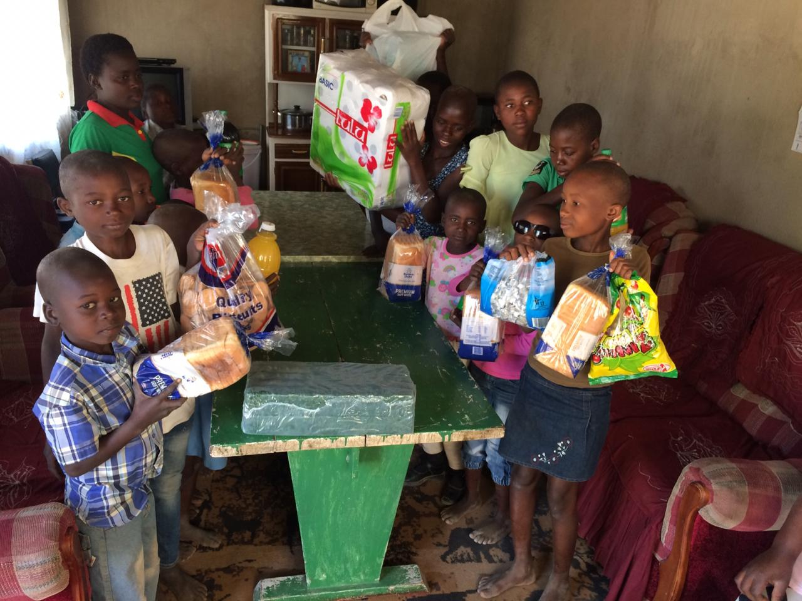

A bone to the dog is not charity. Charity is the bone shared with the dog when you are just as hungry.

On the 13th of June 2020, we visited Tafara Children's Home in Shurugwi Zimbabwe under the Covid-19 Response. 

We managed to donate face masks, and soap. 

During this visit, we also donated sanitary pads for girls, tissues, and some goodies for the children.

We would like to express heartfelt gratitude to everyone who contributed towards this project, thank you and God bless you all.